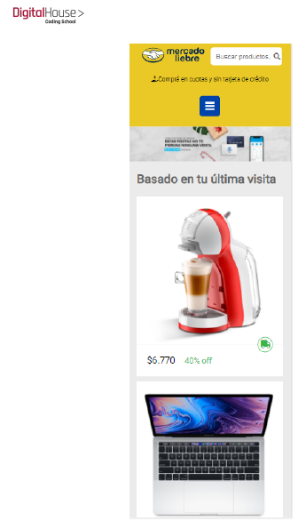

## [Mercado Liebre 2 - Estructura CSS] 

          <figure></figure>
            ## Instrucciones

Para ejecutar el proyecto, sigue estos pasos:

1. Clona el repositorio en tu máquina local utilizando el siguiente comando:

```bash
git clone https://github.com/Aubar48/tpMercadoLiebre.git
```

2. Navega hasta el directorio del proyecto:

```bash
cd tpliebre
```

3. Instala las dependencias del proyecto con el siguiente comando:

```bash
npm install
```

4. Inicia el servidor de desarrollo ejecutando el siguiente comando:

```bash
node app
```

El servidor se levantará en el puerto 3000. Puedes acceder a la aplicación en tu navegador web utilizando la siguiente URL: [http://localhost:3000](http://localhost:3000)
